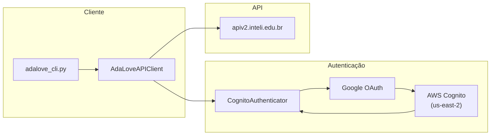
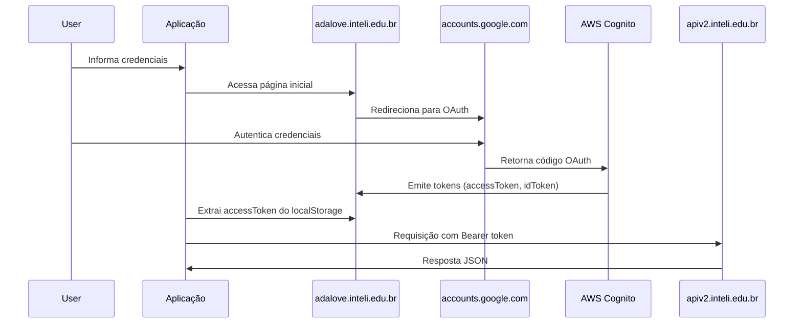

# 📘 API AdaLove - Documentação Completa

> Documentação técnica da API REST do AdaLove para desenvolvedores.

---

## 📋 Índice

- [Visão Geral](#-visão-geral)
- [Autenticação](#-autenticação)
- [Endpoints Reference](#-endpoints-reference)
- [Modelos de Dados](#-modelos-de-dados)
- [Tratamento de Erros](#-tratamento-de-erros)
- [Headers Obrigatórios](#-headers-obrigatórios)
- [Troubleshooting](#-troubleshooting)

---

## 🌐 Visão Geral

### Base URL

```
https://apiv2.inteli.edu.br
```

### Arquitetura



### Descobertas Importantes

> [!IMPORTANT]
> O AdaLove **NÃO usa APIs padrão do Moodle**. É uma API REST customizada com autenticação via AWS Cognito.

| Aspecto | Esperado (Moodle) | Real (AdaLove) |
|---------|-------------------|----------------|
| **Autenticação** | Session cookies | AWS Cognito OAuth2 |
| **Base URL** | `/webservice/rest/server.php` | `apiv2.inteli.edu.br` |
| **Formato** | `wstoken` + `wsfunction` | REST API moderna |

---

## 🔐 Autenticação

### Fluxo OAuth2 com AWS Cognito



### Token de Acesso

O token é obtido do `localStorage` do navegador após autenticação:

```javascript
// Chave do token no localStorage
CognitoIdentityServiceProvider.*.accessToken
```

> [!CAUTION]
> Use **accessToken**, não idToken. O idToken resulta em erro 401.

### Cache de Token

O token é persistido em `.token_cache` para reutilização entre sessões.

```python
# Verificar se já autenticado
if client.auth.is_authenticated():
    # Usar token do cache
    pass
else:
    # Fazer novo login OAuth
    await client.authenticate(login, senha)
```

### Exemplo de Autenticação

```python
from adalove_extractor.api import AdaLoveAPIClient

async with AdaLoveAPIClient() as client:
    await client.authenticate("email@sou.inteli.edu.br", "senha")
    # Token agora disponível para requisições
```

---

## 📡 Endpoints Reference

### 👤 Usuário

#### GET `/users/details`

Retorna informações do usuário autenticado.

**Request:**
```bash
curl -X GET "https://apiv2.inteli.edu.br/users/details" \
  -H "Authorization: Bearer {token}" \
  -H "Origin: https://adalove.inteli.edu.br" \
  -H "Referer: https://adalove.inteli.edu.br/"
```

**Response:**
```json
{
  "id": "uuid-do-usuario",
  "name": "Nome Completo",
  "email": "email@sou.inteli.edu.br",
  "role": "student"
}
```

---

#### GET `/users/menus`

Retorna estrutura de menus/navegação do usuário.

**Request:**
```bash
curl -X GET "https://apiv2.inteli.edu.br/users/menus" \
  -H "Authorization: Bearer {token}" \
  -H "Origin: https://adalove.inteli.edu.br"
```

---

### 📚 Seções (Semanas)

#### GET `/sections`

Lista todas as seções/turmas disponíveis para o usuário.

**Request:**
```bash
curl -X GET "https://apiv2.inteli.edu.br/sections" \
  -H "Authorization: Bearer {token}" \
  -H "Origin: https://adalove.inteli.edu.br"
```

**Response:**
```json
{
  "sections": [
    {
      "id": "123",
      "uuid": "abc-123-def",
      "name": "Semana 01",
      "caption": "2025-1A-T13",
      "start_date": "2025-01-27T00:00:00Z",
      "end_date": "2025-02-02T23:59:59Z",
      "order": 1
    }
  ]
}
```

---

#### GET `/sections/{section_uuid}/userdata`

Dados de progresso do aluno em uma seção específica. Retorna todas as atividades com seus dados de avaliação.

**Parâmetros de Path:**

| Parâmetro | Tipo | Descrição |
|-----------|------|-----------|
| `section_uuid` | string | UUID da seção/semana |

**Request:**
```bash
curl -X GET "https://apiv2.inteli.edu.br/sections/{section_uuid}/userdata" \
  -H "Authorization: Bearer {token}" \
  -H "Origin: https://adalove.inteli.edu.br"
```

**Response (campos por atividade):**

| Campo | Tipo | Descrição |
|-------|------|-----------|
| `studentActivityUuid` | string | UUID da atividade do estudante |
| `status` | int | Status da atividade (1=pendente, 3=concluída) |
| `sort` | int | Ordem de exibição |
| `type` | int | Tipo da atividade (ver tabela de tipos) |
| `caption` | string | Título da atividade |
| `description` | string | Descrição (HTML com entidades) |
| `basicActivityURL` | string | URL do material de referência |
| `professorName` | string | Nome do professor responsável |
| `date` | string\|null | Data/hora agendada (ISO 8601) |
| `folder` | string | UUID da pasta/seção |
| `folderCaption` | string | Nome da pasta (ex: "Semana 02") |
| `gradeWeight` | int | Peso da nota (0 = não ponderada) |
| `checkWeight` | int | Peso de check |
| `conceptWeight` | int | Peso de conceito |
| **`studyQuestion`** | **string** | **Texto da pergunta da avaliação (HTML)** |
| **`studyAnswer`** | **string** | **Resposta submetida pelo aluno** |
| **`evaluated`** | **int** | **Status de avaliação (0=não, 1=sim)** |
| **`gradeResult`** | **string** | **Nota atribuída ("-1.0" = não avaliado)** |
| **`blocked`** | **int** | **Se a atividade está bloqueada (0/1)** |
| `checkResult` | int | Resultado de check (-1 = sem resultado) |
| `conceptResult` | int | Resultado de conceito (-1 = sem resultado) |
| `activityFeedback` | string | Feedback do professor |
| `required` | int | Se é obrigatória (1=sim) |
| `exam` | int | Se é prova (0/1) |

> [!IMPORTANT]
> Os campos `studyQuestion` e `studyAnswer` contêm o conteúdo da aba **"Avaliação"** visível no AdaLove. O `studyQuestion` contém HTML com entidades codificadas (ex: `&eacute;` → `é`).

**Mapeamento de Tipos de Atividade (`type`):**

| Código | Nome Interno | Nome em Português |
|--------|-------------|--------------------|
| 1 | `encontro_orientacao` | Encontro de Orientação |
| 2 | `encontro_instrucao` | Encontro de Instrução |
| 11 | `autoestudo` | Autoestudo |
| 21 | `projeto` | Desenvolvimento de Projetos |
| 31 | `avaliacao` | Avaliação e Pesquisa |

---

### 📝 Atividades (Cards)

#### GET `/student-course-descriptions/section/{section_uuid}`

Lista todas as atividades/cards de uma seção específica.

**Parâmetros de Path:**

| Parâmetro | Tipo | Descrição |
|-----------|------|-----------|
| `section_uuid` | string | UUID da seção/semana |

**Request:**
```bash
curl -X GET "https://apiv2.inteli.edu.br/student-course-descriptions/section/{section_uuid}" \
  -H "Authorization: Bearer {token}" \
  -H "Origin: https://adalove.inteli.edu.br"
```

**Response:**
```json
[
  {
    "id": "456",
    "uuid": "xyz-456-uvw",
    "title": "Instrução - Introdução ao Módulo",
    "description": "Descrição completa da atividade...",
    "type": "instrucao",
    "icon_id": "icon-class",
    "scheduled_at": "2025-01-27T09:00:00Z",
    "professor_name": "Nome do Professor",
    "is_graded": false,
    "points": null,
    "materials": [],
    "links": [],
    "files": [],
    "related_subjects": ["Engenharia de Software"],
    "related_contents": []
  }
]
```

---

#### GET `/student-activities/{student_activity_uuid}/activity/data`

Retorna dados detalhados de uma atividade específica (conteúdos, assuntos, materiais).

**Parâmetros de Path:**

| Parâmetro | Tipo | Descrição |
|-----------|------|-----------|
| `student_activity_uuid` | string | UUID da atividade do estudante |

**Request:**
```bash
curl -X GET "https://apiv2.inteli.edu.br/student-activities/{student_activity_uuid}/activity/data" \
  -H "Authorization: Bearer {token}" \
  -H "Origin: https://adalove.inteli.edu.br"
```

**Response:**
```json
{
  "studentActivity": {
    "activityStatus": 1,
    "attendance1": -1,
    "attendance2": -1,
    "attendance3": -1,
    "checkResult": -1,
    "conceptResult": -1,
    "gradeResult": "-1.0",
    "activityFeedback": "",
    "activityFeedbackGroup": "",
    "studentUuid": "uuid-do-aluno",
    "activityUuid": "uuid-da-atividade",
    "activityType": 11,
    "activityId": 43165,
    "metaprojectUuid": "uuid-do-metaprojeto"
  },
  "subjects": [
    { "uuid": "uuid", "subject": "Nome do assunto" }
  ],
  "contents": [
    { "uuid": "uuid", "caption": "Título", "reference": "https://..." }
  ],
  "prerequisites": [
    { "caption": "Título", "uuid": "uuid", "relationship": "tipo" }
  ],
  "tasks": [],
  "activityStudyMaterial": [],
  "metaprojectUuid": "uuid-do-metaprojeto",
  "activityVideoMaterial": []
}
```

> [!NOTE]
> Este endpoint **não contém** a pergunta da avaliação (`studyQuestion`) nem a resposta do aluno (`studyAnswer`). Esses dados estão disponíveis no endpoint `/sections/{section_uuid}/userdata`.

---

### 🔔 Outros

#### GET `/notifications`

Sistema de notificações do usuário.

```bash
curl -X GET "https://apiv2.inteli.edu.br/notifications" \
  -H "Authorization: Bearer {token}"
```

---

#### GET `/versions`

Verificação de versão da API.

```bash
curl -X GET "https://apiv2.inteli.edu.br/versions" \
  -H "Authorization: Bearer {token}"
```

---

## 📦 Modelos de Dados

### APISection

Representa uma seção/semana no sistema.

```python
class APISection(BaseModel):
    id: str                           # ID da seção
    uuid: str                         # UUID da seção
    name: str                         # Nome (ex: 'Semana 01')
    start_date: Optional[datetime]    # Data de início
    end_date: Optional[datetime]      # Data de término
    order: int                        # Ordem da seção
```

### APIActivity

Representa uma atividade/card.

```python
class APIActivity(BaseModel):
    # Campos básicos
    id: str                           # ID da atividade
    uuid: str                         # UUID da atividade
    title: str                        # Título da atividade
    description: Optional[str]        # Descrição completa
    type: Optional[str]               # Tipo da atividade
    icon_id: Optional[str]            # ID do ícone SVG
    
    # Campos temporais
    scheduled_at: Optional[datetime]  # Data/hora agendada
    
    # Campos de professor
    professor_name: Optional[str]     # Nome do professor
    
    # Conteúdo relacionado
    related_subjects: List[str]       # Assuntos relacionados
    related_contents: List[Dict]      # Conteúdos relacionados
    
    # Avaliação
    is_graded: bool = False           # Se é atividade avaliativa
    points: Optional[int]             # Pontos da atividade
    
    # Materiais
    materials: List[Dict]             # Materiais de estudo
    links: List[Dict]                 # Links externos
    files: List[Dict]                 # Arquivos anexados
```

### Campos de Avaliação (Ponderada)

Campos presentes no response de `/sections/{uuid}/userdata` para atividades com `gradeWeight > 0`:

```python
# Campos de avaliação (disponíveis em userdata, NÃO em activity/data)
studyQuestion: str        # Pergunta da avaliação (HTML)
studyAnswer: str          # Resposta submetida pelo aluno
evaluated: int            # 0 = não avaliado, 1 = avaliado
gradeResult: str          # Nota: "-1.0" = não avaliado, "X.X" = nota
blocked: int              # 0 = desbloqueado, 1 = bloqueado
gradeWeight: int          # Peso da avaliação (0 = não ponderada)
checkWeight: int          # Peso de check
conceptWeight: int        # Peso de conceito
```

### APIUserDetails

Detalhes do usuário autenticado.

```python
class APIUserDetails(BaseModel):
    id: str                     # ID do usuário
    name: str                   # Nome completo
    email: str                  # Email
    role: Optional[str]         # Papel/função (ex: "student")
```

---

## ⚠️ Tratamento de Erros

### Exceções Customizadas

| Exceção | HTTP Status | Descrição |
|---------|-------------|-----------|
| `AuthenticationError` | 401 | Token inválido ou expirado |
| `TokenExpiredError` | 401 | Token expirou e refresh falhou |
| `EndpointNotFoundError` | 404 | Endpoint não existe |
| `RateLimitError` | 429 | Limite de requisições excedido |
| `APIError` | 5xx | Erro genérico de API |

### Estratégia de Retry

O cliente implementa retry automático com exponential backoff:

```python
# Configuração padrão
max_retries = 3
timeout = 30  # segundos

# Backoff exponencial
for attempt in range(max_retries):
    try:
        response = await client.get(endpoint)
    except Exception:
        await asyncio.sleep(2 ** attempt)  # 1s, 2s, 4s
```

### Códigos de Resposta

| Código | Significado | Ação |
|--------|-------------|------|
| 200 | Sucesso | Processar resposta |
| 401 | Não autorizado | Renovar token e tentar novamente |
| 404 | Não encontrado | Verificar endpoint |
| 429 | Rate limit | Aguardar `Retry-After` segundos |
| 500 | Erro do servidor | Retry com backoff |

---

## 🔧 Headers Obrigatórios

> [!WARNING]
> Os headers `Origin` e `Referer` são **críticos** para evitar erro 500 em alguns endpoints.

```python
headers = {
    # Autenticação
    "Authorization": f"Bearer {token}",
    
    # Content
    "Content-Type": "application/json",
    "Accept": "application/json, text/plain, */*",
    "Accept-Language": "pt-BR,pt;q=0.9,en-US;q=0.8,en;q=0.7",
    
    # Browser identity
    "User-Agent": "Mozilla/5.0 (Macintosh; Intel Mac OS X 10_15_7) ...",
    
    # CORS (CRÍTICO)
    "Origin": "https://adalove.inteli.edu.br",
    "Referer": "https://adalove.inteli.edu.br/",
    
    # Sec-* headers
    "sec-ch-ua": '"Google Chrome";v="131", ...',
    "sec-ch-ua-mobile": "?0",
    "sec-ch-ua-platform": '"macOS"',
    "sec-fetch-dest": "empty",
    "sec-fetch-mode": "cors",
    "sec-fetch-site": "same-site",
}
```

---

## 🔍 Troubleshooting

### Erro 401 - Token Inválido

**Causas:**
- Token expirado
- Usando `idToken` ao invés de `accessToken`

**Solução:**
```bash
# Limpar cache e re-autenticar
rm .token_cache
python adalove_cli.py
```

### Erro 500 - Internal Server Error

**Causas:**
- Headers `Origin`/`Referer` ausentes
- Requisição mal formatada

**Solução:**
Garantir que todos os headers browser-like estão presentes (ver seção Headers Obrigatórios).

### Timeout de Autenticação

**Causas:**
- Conexão lenta
- Verificação 2FA pendente

**Solução:**
```python
# Aumentar timeout (padrão: 35s)
await client.auth.authenticate_google_oauth(
    login, senha, 
    timeout_seconds=60
)
```

### Token Não Encontrado

**Causas:**
- Login falhou silenciosamente
- Captcha ou verificação adicional

**Solução:**
1. Fazer login manual em https://adalove.inteli.edu.br
2. Abrir DevTools (F12) → Application → Local Storage
3. Copiar valor de `...accessToken`
4. Salvar em `.token_cache`

---

## 📚 Referências

- [README.md](../README.md) - Documentação principal do projeto
- [adalove-api-research.md](./adalove-api-research.md) - Pesquisa inicial sobre a API
- [api-extraction-design.md](./api-extraction-design.md) - Design da arquitetura de extração

---

**Última atualização:** 2026-02-11  
**Versão da API:** v2  
**Mantido por:** Fernando Bertholdo
